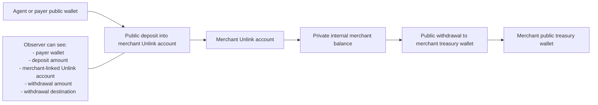
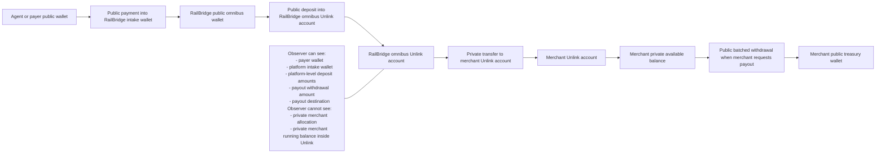
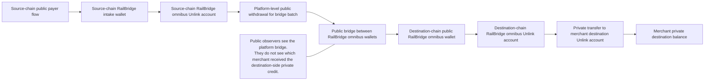

# RailBridge Private Treasury Architecture

## Purpose

This document proposes a privacy-first treasury mode for RailBridge so merchants can accept USDC payments without exposing a clean public revenue trail to outside observers.

The goal is not perfect anonymity. The goal is to make it materially harder for third parties to infer:

- merchant revenue
- merchant treasury balances
- payer-to-merchant relationships
- payout cadence tied 1:1 to receipts

## Why the current model leaks too much

Today RailBridge is public by construction:

- merchant balances are derived from public RPC reads against merchant custody wallets
- settlement timelines store and display tx hashes
- payouts are plain ERC-20 transfers to public destination addresses
- cross-chain consolidation uses public bridge transactions

This is a strong operational MVP, but it does not meet the privacy expectations of serious merchants.

## Privacy goals

1. Outside observers should not be able to map every customer payment directly to a merchant-owned public wallet.
2. Outside observers should not be able to derive merchant treasury balances by watching one public address per chain.
3. Merchant OS should present private balances as first-class product data, instead of treating public wallet balances as the source of truth.
4. Merchants should still be able to withdraw to public wallets when they choose, with explicit tradeoffs.

## Non-goals

1. Hiding activity from RailBridge itself.
2. Hiding activity from the merchant.
3. Fully private fiat off-ramp behavior.
4. Perfect unlinkability when a merchant withdraws exact amounts immediately after every payment.

## x402 public-settlement constraint

RailBridge privacy mode has to start from a clear constraint:

- the current `x402 exact` settlement leg is public

That means the payment transaction itself is still a normal public on-chain settlement:

- payer address is public
- settlement amount is public
- settlement network is public
- payee address is public
- settlement tx hash is public

So RailBridge should not frame privacy mode as:

- "make x402 settlement private"

It should frame privacy mode as:

- "accept a public x402 payment, then move merchant treasury accounting and allocation into a private layer"

This is the core architecture distinction:

`public payment rail -> private treasury rail`

## What privacy RailBridge can and cannot provide

There are three different observers to think about.

### 1. The buyer or calling agent

In a normal direct x402 flow, the buyer usually already knows the merchant because:

- the buyer is calling that merchant's endpoint
- the API domain or route may identify the merchant
- the payment requirement came from a merchant-specific integration

RailBridge generally cannot hide the merchant from the buyer in a direct merchant API flow.

### 2. The public blockchain

This is where RailBridge can create meaningful privacy improvements.

If the x402 `payTo` address is merchant-specific, chain observers can often infer:

- which merchant received the payment
- how much revenue that merchant is collecting
- the merchant's treasury growth over time

If the x402 `payTo` address is a shared RailBridge gateway address instead, chain observers see:

- payer -> RailBridge

They do not automatically see:

- payer -> merchant treasury

This is the main privacy win.

### 3. RailBridge itself

RailBridge still needs to know:

- which merchant the payment belongs to
- how much to credit
- which treasury policy should apply
- whether the route should remain public or move into a private treasury zone

So this design is not about hiding information from RailBridge. It is about hiding merchant treasury attribution from public observers.

## Merchant identity leakage: buyer-visible vs chain-visible

It is important not to mix these two concepts.

### Buyer-visible merchant identity

If a buyer is calling `merchant.example.com/premium`, the buyer already knows they are paying that merchant.

Private treasury does not change that.

### Chain-visible merchant identity

This *can* change.

If the public on-chain recipient is RailBridge rather than the merchant, the chain no longer needs to expose the merchant treasury destination for each payment.

That means merchant identity may still be obvious to the buyer while being much less obvious to public blockchain observers.

## What RailBridge should change in privacy mode

For privacy-enabled merchants, the x402 payment requirement should no longer point directly at a merchant treasury wallet.

Instead:

1. the merchant endpoint still returns a normal x402 payment requirement
2. the `payTo` address is a RailBridge-controlled gateway or facilitator address
3. the public x402 settlement lands at RailBridge
4. RailBridge credits the merchant inside the private treasury layer
5. the merchant withdraws later, independently from the original settlement timing

This means the public x402 payment remains visible, but the merchant revenue destination becomes private after settlement.

## Metadata minimization in payment requirements

Even if the on-chain recipient becomes RailBridge, privacy mode can still leak too much if the payment requirement payload exposes merchant-specific metadata too broadly.

For privacy mode, RailBridge should minimize client-visible requirement data.

Prefer:

- opaque quote IDs
- opaque product IDs
- generic route descriptions where possible

Avoid exposing directly in client-visible requirement metadata when not strictly needed:

- internal `merchantId`
- internal `accountId`
- merchant-specific treasury routing details

This does not make the merchant invisible to the buyer, but it reduces unnecessary metadata leakage across the payment path.

## Same-chain implication

In a traditional same-chain x402 flow, the simplest setup is often:

- payer pays directly to the merchant wallet

That is the least private option for merchant revenue.

For privacy mode, even same-chain flows should usually settle to a RailBridge-controlled address first if merchant treasury privacy is the goal.

That is a meaningful product shift:

- same-chain privacy mode should favor gateway settlement
- direct merchant-wallet settlement should remain the public-mode path

## Cross-chain implication

Cross-chain RailBridge already naturally pushes more settlement logic through platform-controlled routing.

That is helpful for privacy mode, because the platform is already closer to the public settlement path.

The privacy upgrade is then:

- keep the public settlement and bridge at the platform layer
- move merchant attribution and merchant balance ownership into the private layer after settlement

## Decision rule

If a merchant enables private treasury mode, RailBridge should use this rule:

- public x402 settlement may remain public
- merchant-specific treasury receipt should not be public unless the route is forced into a public fallback mode

In practical terms:

- `x402` can stay public
- merchant treasury attribution should move private as early as possible after settlement
- merchant payout can become public again when the merchant chooses to withdraw

## Key constraint: what Unlink can and cannot hide

Unlink is promising, but it is not magic.

- deposits into the Unlink contract are public
- withdrawals from the Unlink contract are public
- private transfers between Unlink accounts are private
- `execute()` hides the funding private account, but the external call and amount are still public

That means Unlink is strongest when it is used as a private internal balance layer, not when every payment deposits or withdraws directly into a merchant-specific public flow.

## Recommended architecture

The recommended model is:

`public settlement intake -> platform omnibus privacy pool -> private merchant allocations -> batched merchant withdrawals`

This is stronger than sending receipts directly into merchant public wallets and then trying to hide them afterward.

## Privacy diagrams

## Diagram 1: naive direct-to-merchant Unlink flow

### What leaks in the naive model

- If the merchant's `unlink1` account becomes associated with that merchant, public deposits into it can reveal incoming revenue patterns.
- Private transfers do not help much if most funds are deposited directly into the merchant-linked private account.
- The withdrawal remains public and can still reinforce revenue inference.

## Diagram 2: recommended RailBridge omnibus privacy pool

### Why the omnibus model is stronger

- Public inflows terminate at a platform-controlled pool, not a merchant-specific private account.
- Merchant allocations happen as private transfers inside Unlink.
- A merchant withdrawal is visible, but it is harder to tie it to specific receipts if the platform batches and delays payouts.

## Diagram 3: cross-chain private treasury with public platform bridge

### Cross-chain takeaway

- Unlink does not make the bridge itself private.
- It does let RailBridge keep the bridge merchant-agnostic in public and merchant-specific in private.

## Bridge coverage constraints for RailBridge

Unlink support coverage is a first-order design constraint for RailBridge.

RailBridge already supports many source and destination chains, while Unlink currently supports only a smaller set of hosted environments. As of June 13, 2026, the published Unlink environments in the docs are:

- `arc-testnet`
- `base-sepolia`
- `ethereum-sepolia`
- `monad-testnet`

That means RailBridge privacy mode cannot be treated as a universal replacement for the current bridge architecture. It has to be a hybrid routing layer.

## Why this matters

RailBridge is fundamentally a cross-chain treasury product, not just a same-chain payout product.

So the design question is not only:

- "can a merchant hold funds privately?"

It is also:

- "on which chains can they hold funds privately?"
- "when does a cross-chain route leave the private domain?"
- "when can a route re-enter the private domain?"
- "what should happen on unsupported chains?"

## Privacy coverage matrix

RailBridge should think about every route in one of four buckets.

| Source chain | Destination or treasury chain | Privacy result | Bridge implication |
| --- | --- | --- | --- |
| Unlink-supported | Unlink-supported | Strongest mode | Public bridge can stay platform-level, then funds re-enter private mode on destination |
| Unsupported | Unlink-supported | Partial mode | Source receipt and bridge-in are public, but merchant allocation after arrival can be private |
| Unlink-supported | Unsupported | Partial mode | Merchant can hold privately before bridge-out, but destination-side treasury becomes public |
| Unsupported | Unsupported | No Unlink privacy gain | Fall back to current public RailBridge path |

## What this means operationally

Privacy is not a single switch. It becomes route-dependent.

Two merchants can both be in `private` treasury mode but receive different privacy guarantees depending on:

- payer source chain
- merchant preferred treasury chain
- payout destination chain
- whether the route ever needs to touch an unsupported network

Merchant OS should surface this explicitly instead of presenting privacy as binary.

Suggested labels:

- `full_private`
- `partial_private`
- `public_fallback`

## Recommended hybrid bridge model

For chains not supported by Unlink, RailBridge should treat privacy as a domain that funds can enter and leave.

The practical model is:

1. public source chain intake
2. public platform bridge between RailBridge-controlled omnibus wallets
3. private re-entry only on supported destination chains

In other words:

- unsupported chains are public edges
- supported Unlink chains are private treasury zones

This lets RailBridge preserve privacy where possible without pretending unsupported routes are private.

## Supported -> supported route

This is the ideal future mode.

Flow:

1. source-chain payer settles into RailBridge public intake
2. RailBridge deposits pooled funds into source-chain omnibus Unlink
3. RailBridge withdraws aggregated platform funds for bridge execution
4. RailBridge bridges publicly between platform wallets
5. RailBridge deposits into destination-chain omnibus Unlink
6. RailBridge privately credits the merchant on the destination chain

Public sees:

- platform intake
- platform bridge batch
- platform destination deposit

Public does not see:

- merchant allocation on either side

## Unsupported -> supported route

This is likely the most important early hybrid mode for RailBridge.

Flow:

1. payment settles publicly on the unsupported source chain
2. RailBridge bridges publicly from a platform source wallet
3. RailBridge lands funds in a public platform wallet on a supported Unlink chain
4. RailBridge deposits into the supported-chain omnibus Unlink account
5. RailBridge privately credits the merchant

Result:

- source receipt remains public
- bridge remains public
- merchant treasury after arrival can still be private

This is useful when the merchant wants a private treasury home chain even if some payer chains are unsupported.

## Supported -> unsupported route

This route loses privacy on exit.

Flow:

1. merchant may hold funds privately on the supported chain
2. RailBridge withdraws public platform funds from the privacy pool
3. RailBridge bridges publicly to the unsupported destination
4. payout or treasury settlement completes publicly on the destination side

Result:

- privacy is preserved while funds remain in the private zone
- destination treasury state becomes public once funds leave that zone

This can still be acceptable for merchant-requested payouts, but it should not be marketed as end-to-end private treasury.

## Unsupported -> unsupported route

This route should usually stay on the current public RailBridge architecture.

Unlink may still help in other parts of the system later, but it does not materially improve treasury privacy for this path.

## Product implication: choose a privacy home chain

Because support is partial, RailBridge should let each merchant choose a preferred private treasury chain from the set of Unlink-supported chains.

That chain becomes the merchant's privacy home base.

Example:

- a merchant accepts payments on many public chains
- unsupported-chain receipts are bridged publicly at the platform layer
- once funds arrive on the merchant's supported privacy home chain, RailBridge credits them privately inside Unlink

This is a more realistic near-term product than trying to make every supported RailBridge chain private immediately.

## Bridge service changes

RailBridge's bridge service should become privacy-aware, not privacy-assuming.

It should understand at least three bridge intents:

1. `public_to_private_zone`
2. `private_zone_to_public`
3. `public_to_public`

The key behavior change is that bridges should operate between platform omnibus wallets, not merchant-specific wallets, whenever the route touches private treasury mode.

That keeps public bridge traces platform-level rather than merchant-level.

## Policy engine changes

Merchant treasury policy should gain new fields for hybrid routing decisions.

Suggested additions:

- `treasuryMode`: `public` or `private`
- `privateHomeChain`
- `allowUnsupportedSourceChains`
- `allowUnsupportedDestinationChains`
- `unsupportedChainBehavior`: `bridge_to_private_home`, `stay_public`, or `reject`

This prevents hidden ambiguity when a merchant enables privacy mode but receives funds on a chain outside the Unlink support set.

## UX implications for Merchant OS

Merchant OS should explain privacy per balance and per route.

Suggested behavior:

- show whether a balance is currently in a private zone or a public zone
- show whether a pending bridge is moving funds into privacy or out of privacy
- warn when a payout destination chain is unsupported and will make the final leg public
- avoid promising "private treasury" on unsupported routes

## Rollout implication

The first production-quality privacy release should probably not target all RailBridge chains equally.

A better rollout is:

1. pick one supported Unlink chain as the initial merchant privacy home chain
2. support same-chain private treasury first
3. support unsupported -> private-home-chain bridge flows next
4. add supported -> supported multi-zone private routing only after the ledger and omnibus pool operations are stable

This keeps the bridge complexity manageable while still creating a real merchant privacy improvement.

## Hackathon MVP scope

For the hackathon, RailBridge should explicitly support every Unlink environment that is currently available, rather than limiting privacy mode to a single chain.

As of June 13, 2026, the currently listed available Unlink environments are:

- `arc-testnet`
- `base-sepolia`
- `bsc-testnet`
- `ethereum-sepolia`
- `monad-testnet`

These should be treated as RailBridge's initial privacy-enabled treasury zones.

## Hackathon architecture target

The hackathon version should aim for:

1. a RailBridge public gateway wallet per supported Unlink network
2. a RailBridge omnibus Unlink account per supported Unlink network
3. a merchant Unlink account on each supported Unlink network the merchant enables
4. private merchant balances and withdrawals on all currently supported Unlink networks
5. route labeling that distinguishes `full_private`, `partial_private`, and `public_fallback`

This gives RailBridge a credible "supports all current Unlink networks" story while keeping the architecture aligned with the longer-term privacy design.

## Hackathon network strategy

Not every supported Unlink network needs the same depth of demo polish.

Recommended split:

- `arc-testnet` as the flagship end-to-end x402 + Unlink demo path
- `base-sepolia`, `bsc-testnet`, `ethereum-sepolia`, and `monad-testnet` as supported privacy treasury zones in Merchant OS

Why Arc should be the flagship demo:

- Unlink's current x402 tutorial is built around Arc Testnet
- the documented flow already shows `private balance -> withdraw to payer EOA -> pay x402`
- this makes Arc the strongest path for a complete buyer-to-merchant privacy demonstration

The other supported networks still matter for the hackathon because they prove RailBridge is not a one-chain privacy prototype.

## Hackathon promise

For the demo, RailBridge should be able to say:

- public x402 settlement is supported
- private merchant treasury is supported on every currently available Unlink network
- unsupported RailBridge networks can bridge into a supported private treasury zone when configured

This is a stronger and more accurate statement than claiming all RailBridge-supported chains are private.

## Hackathon implementation priorities

Priority 1:

- make privacy-mode merchant balances work on all five Unlink-supported networks
- let a merchant choose any of those networks as a private home chain

Priority 2:

- make Arc Testnet the best polished end-to-end x402 demo

Priority 3:

- for unsupported payer chains, show public-to-private re-entry into one of the five supported privacy zones

Priority 4:

- postpone generalized supported-to-supported private bridge automation if needed, as long as Merchant OS can still represent the privacy state correctly

## Hackathon success criteria

The MVP is successful if:

1. a merchant can enable private treasury mode on any currently supported Unlink environment
2. Merchant OS shows private balances on all five supported networks
3. at least one end-to-end x402 payment demo works cleanly on Arc Testnet
4. the product clearly communicates when a route is fully private, partially private, or public fallback

## Hackathon non-goals

To keep scope under control, the hackathon version does not need:

- production-grade compliance posture
- support for every RailBridge chain as a private zone
- full private bridge automation between every supported Unlink network
- perfect payer anonymity on every route

The win condition is demonstrating a believable multi-network private treasury experience that works across the full currently available Unlink footprint.

## Core idea

Instead of one public custody wallet per merchant being the primary treasury surface, RailBridge operates:

1. a public omnibus intake wallet per supported chain
2. a platform omnibus Unlink account per chain
3. a private merchant Unlink account per merchant treasury account
4. a private internal ledger in Merchant OS as the operational source of truth

The privacy value comes from this sequence:

1. many public payments land in shared platform-controlled intake wallets
2. RailBridge periodically deposits pooled funds into the platform omnibus Unlink account
3. RailBridge privately transfers balances from the omnibus account to merchant private accounts
4. Merchant OS shows private available balances from the ledger and Unlink state, not from public wallet reads
5. withdrawals happen later in batched windows, so public payout activity is not trivially linkable to each receipt

## Why omnibus matters

If RailBridge deposited directly from a public wallet into a merchant-specific Unlink account, observers could still correlate that deposit to that merchant.

The omnibus pool breaks that link:

- the public deposit belongs to the platform pool
- the merchant allocation happens as a private Unlink transfer
- outsiders can observe platform inflows and outflows, but not merchant-specific internal distribution

## High-level flow

## 1. Payment intake

For privacy-enabled merchants, x402 settlement no longer pays directly into a merchant-owned public treasury wallet.

Instead:

- payer settles into a RailBridge-controlled public intake wallet on the source chain
- Merchant OS credits a pending merchant balance in the internal ledger
- the platform sweeps pooled balances into the chain’s platform omnibus Unlink account on a schedule or threshold

This means the public chain shows platform-level intake, not merchant-level treasury balances.

## 2. Private merchant allocation

After the sweep:

- RailBridge performs a private Unlink transfer from the platform omnibus account to the merchant’s private Unlink account
- Merchant OS updates the merchant’s private available balance

This is the step that actually hides merchant revenue distribution.

## 3. Merchant balance experience

Merchant OS should treat the private ledger as the main balance source.

The dashboard should expose:

- private available balance
- pending sweep balance
- scheduled withdrawal balance
- settlement activity without mandatory public tx hash exposure for private legs

Public explorer links become optional audit details, not the default UX contract.

## 4. Merchant withdrawals

When a merchant wants funds in a public wallet:

- Merchant OS creates a withdrawal request from the merchant’s private Unlink account
- RailBridge batches withdrawals into payout windows
- the withdrawal goes to the merchant’s chosen public address

This withdrawal is public, but it is no longer cleanly tied to each incoming payment if:

- withdrawals are delayed
- withdrawals are batched
- payout amounts are policy-driven rather than mirrored from each receipt

## 5. Cross-chain movement

Unlink does not give RailBridge a private cross-chain bridge by itself.

For cross-chain privacy, the recommended model is:

1. source-chain public receipts land in the source omnibus wallet
2. pooled source-chain funds are deposited into the source omnibus Unlink account
3. if RailBridge needs destination-chain liquidity, the platform withdraws aggregated funds from the source omnibus account
4. the platform performs a public bridge between platform-controlled omnibus addresses
5. on the destination chain, the platform deposits those funds into the destination omnibus Unlink account
6. the platform privately transfers balances to merchant destination private accounts

This keeps cross-chain movements visible at the platform level while avoiding merchant-specific public bridge traces.

## Architecture components

## A. Privacy Vault Service

A new service layer should manage Unlink integration for custodial server mode:

- create platform omnibus private accounts per chain
- create merchant private accounts
- manage auth tokens and account registration
- execute private transfers
- execute withdrawals
- read private balances and transaction status

Suggested file location:

- `merchant-os/src/privacyVaultService.js`

## B. Private Treasury Ledger

Merchant OS needs a ledger that no longer assumes public wallets are the primary source of truth.

Suggested tables:

- `private_accounts`
- `private_balance_snapshots`
- `private_ledger_entries`
- `omnibus_sweeps`
- `private_transfers`
- `withdrawal_batches`
- `merchant_privacy_policies`

Suggested ledger event types:

- `payment.settled_public_intake`
- `omnibus.sweep_submitted`
- `omnibus.sweep_confirmed`
- `merchant.private_credit`
- `merchant.private_debit`
- `merchant.withdrawal_requested`
- `merchant.withdrawal_submitted`
- `merchant.withdrawal_confirmed`

## C. Treasury mode switch

Merchant accounts should explicitly choose a treasury mode:

- `public`
- `private`

In `public` mode, current behavior remains.
In `private` mode, new privacy routing applies.

This allows gradual rollout without breaking current flows.

## D. Privacy-aware settlement publisher

The facilitator should publish richer lifecycle events for privacy-mode merchants:

- public intake tx hash
- sweep batch id
- private credit id
- optional eventual withdrawal batch id

The merchant-facing API should not default to returning every internal public trace as a user-visible explorer link.

## Repo impact

## Merchant OS

The following areas will need to change first:

- `merchant-os/src/onchain.js`
  - public RPC balance reads can no longer be the primary balance source for private-mode merchants
- `merchant-os/src/server.js`
  - add treasury mode branching for balances, settlements, payouts, and consolidations
- `merchant-os/src/usdcTransferService.js`
  - direct ERC-20 payout flow becomes a public-mode path, not the only payout path
- `merchant-os/frontend/app/overview/page.js`
  - show private available balance and pending sweep state
- `merchant-os/frontend/app/settlements/page.js`
  - hide or collapse public tx links for private internal steps

## Facilitator

- settlement routing must support omnibus intake destinations
- batching logic should be reused for sweep windows and cross-chain liquidity movement
- bridge execution should operate on platform omnibus balances for privacy mode

## Phase plan

## Phase 0: architecture prototype

- add `private` treasury mode behind a feature flag
- integrate Unlink only in test environments currently supported by their hosted environments
- keep same-chain only for the first prototype
- model platform omnibus account plus one merchant private account

Success condition:

- a merchant can receive public intake settlements and see a private internal balance that is not readable from a merchant public wallet

## Phase 1: private same-chain treasury

- support periodic public intake sweeps into platform omnibus Unlink accounts
- support private merchant credits
- support batched merchant withdrawals
- update Merchant OS balance and timeline UX for private mode

Success condition:

- merchant-level revenue is no longer trivially derivable from a single public treasury address

## Phase 2: private cross-chain treasury

- operate per-chain platform omnibus pools
- bridge only aggregated platform funds between chains
- privately allocate balances on destination chains after bridge completion
- add per-chain liquidity policy for withdrawal responsiveness

Success condition:

- cross-chain flows remain publicly visible only at the platform aggregate level, not the merchant level

## Phase 3: payer privacy

Once merchant privacy is working, RailBridge can optionally add payer privacy patterns:

- payer funds a private Unlink balance
- payer withdraws to an ephemeral EOA
- payer uses that EOA for x402 settlement

This improves payer privacy, but it is separate from merchant treasury privacy.

## Risks and open questions

1. Unlink environment coverage
   - current documentation appears testnet-heavy, so production rollout depends on real mainnet support and operational readiness
2. Custody posture
   - custodial private account management changes RailBridge’s trust and compliance surface area
3. Withdrawal privacy limits
   - poorly designed payout behavior can reintroduce obvious revenue inference
4. Liquidity management
   - private ledgers are only useful if platform omnibus pools stay liquid enough to honor withdrawals quickly
5. Reconciliation
   - Merchant OS will need stronger ledger discipline because public wallet balances are no longer the simple primary truth

## Immediate implementation direction

The first code milestone should not be "wire Unlink everywhere."

It should be:

1. add a `treasuryMode` concept
2. introduce a `privacyVaultService` abstraction
3. stop assuming public wallet balances are the primary balance source for every merchant
4. prototype one private-mode same-chain flow end-to-end on a supported Unlink test environment

That gives RailBridge a safe place to validate the product and operational model before attempting mainnet or cross-chain privacy.
