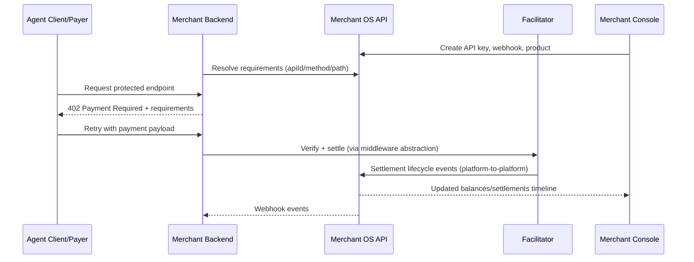

# RailBridge Merchant Integration Guide (Agent-Native)

Last reviewed: 2026-05-20

This guide is written so a merchant team or coding agent (Codex, Claude) can integrate RailBridge with minimal ambiguity.

Goal: merchant accepts USDC payments on protected API routes without handling blockchain, chain routing, or facilitator verify/settle internals.

## 1) Integration Outcome

When integration is complete:

1. Unpaid request to protected route returns `402 Payment Required`.
2. Agent/client can pay and retry the same route successfully.
3. Settlement lifecycle appears in Merchant OS (`settled_source`, `bridge_pending`, `bridge_confirmed`, `failed`).
4. Merchant receives webhook events on their backend URL.

## 2) Public Contract (Use This)

Use only these merchant-facing contracts:

1. Session auth:
   - `POST /v1/auth/login`
   - `POST /v1/onboarding/start`
   - `GET /v1/onboarding/checklist`
   - `GET /v1/onboarding/settings`
   - `POST /v1/onboarding/api-keys`
   - `PATCH /v1/onboarding/api-keys/{apiKeyId}`
   - `POST /v1/onboarding/api-keys/{apiKeyId}/revoke`
   - `POST /v1/onboarding/webhooks`
   - `PATCH /v1/onboarding/webhooks/{webhookId}`
   - `DELETE /v1/onboarding/webhooks/{webhookId}`
   - `POST /v1/onboarding/webhooks/test`
   - `POST /v1/onboarding/products`
2. Merchant runtime (`x-railbridge-api-key`):
   - `GET /v1/merchants/{merchantId}/balances`
   - `GET /v1/merchants/{merchantId}/settlements`
   - `GET /v1/merchants/{merchantId}/products`
   - `POST /v1/merchants/{merchantId}/products`
   - `PUT /v1/merchants/{merchantId}/products/{apiProductId}`
   - `DELETE /v1/merchants/{merchantId}/products/{apiProductId}`
   - `GET /v1/merchants/{merchantId}/payouts`
   - `POST /v1/merchants/{merchantId}/payouts`
3. Merchant SDK requirement resolver:
   - `POST /v1/sdk/requirements/resolve` (`x-railbridge-api-key`)

Do not use internal endpoints in merchant integration code:

1. `/v1/internal/*`
2. facilitator direct `/verify` and `/settle`

## 3) Merchant Setup Sequence

Use this order:

1. Create merchant account and admin user.
2. Create API key and store token immediately.
3. Register webhook URL.
4. Create first paid product (`method`, `path`, `price`).
5. Integrate backend middleware for protected routes.
6. Run sandbox payment test.

## 4) Architecture Flow



## 5) Backend Integration (Recommended Prototype Path)

Current fastest path is to use the payment guard adapter.

Minimal Express integration shape:

```ts
import express from "express";
import { createMerchantOsPaymentGuard } from "./services/merchantOsPaymentGuard.js";

const app = express();
app.use(express.json());

const paymentGuard = await createMerchantOsPaymentGuard({
  facilitatorUrl: process.env.RB_ENV === "live" ? "https://facilitator.railbridge.xyz" : "http://localhost:4022",
  merchantOsApiUrl: process.env.RB_ENV === "live" ? "https://api.railbridge.xyz" : "http://localhost:4030",
  merchantApiKey: process.env.RB_API_KEY,
  route: { method: "GET", path: "/api/premium" },
  paywallTestnet: process.env.RB_ENV !== "live"
});

app.use(paymentGuard.middleware);

app.get("/api/premium", (_req, res) => {
  res.json({ ok: true, message: "Paid route access granted" });
});

app.listen(4021);
```

Reference implementation:

1. `facilitator/src/merchant-server-merchant-os-demo.ts`
2. `facilitator/src/services/merchantOsPaymentGuard.ts`

## 6) Product Defaults (Simplicity-First)

If merchant omits advanced fields:

1. `sourceNetwork` defaults to `any`
2. `settlementMode` defaults to `cross_chain`
3. destination network falls back to treasury policy

This means merchant can accept USDC from supported chains without choosing source/destination manually.

## 7) Webhook Contract

Merchant should expose an HTTPS `POST` endpoint such as:

1. `https://api.yourcompany.com/webhooks/railbridge`

Headers:

1. `x-railbridge-event`
2. `x-railbridge-event-id`
3. `x-railbridge-timestamp`
4. `x-railbridge-signature`

Signature model:

1. `HMAC_SHA256(signingSecret, timestamp + "." + rawBody)`

Expected events:

1. `payment.settled_source`
2. `payment.bridge_pending`
3. `payment.bridge_confirmed`
4. `payment.failed`
5. `payout.completed`
6. `payout.failed`
7. `webhook.test`

## 8) Agent Task Packet (Machine-Readable)

```yaml
railbridge_integration_task:
  version: "2026-05-20"
  objective: "Integrate RailBridge paid-route acceptance with webhook handling."
  assumptions:
    - "Merchant knows HTTP backend development."
    - "Merchant should not handle blockchain routing logic."
  required_inputs:
    - "RB_API_KEY"
    - "MERCHANT_ID"
    - "At least one paid product (apiId+method+path+amountUsdc)"
    - "Webhook URL"
  do_not_use:
    - "/v1/internal/*"
    - "Direct facilitator /verify or /settle calls in merchant code"
  implementation_steps:
    - "Mount payment middleware/guard before protected route handlers."
    - "Protect at least one route (for example GET /api/premium)."
    - "Return 200 from webhook handler quickly after signature verification."
  verification:
    - "GET protected route without payment returns 402."
    - "Merchant OS settlements API shows lifecycle items."
    - "Webhook test event reaches merchant webhook endpoint."
  done_when:
    - "Paid route works end-to-end."
    - "Webhook signatures verify successfully."
    - "Console shows non-empty settlement timeline."
```

## 9) Copy-Paste Prompt For Codex/Claude

Use this prompt in merchant codebase:

```text
Integrate RailBridge paid-route support in this backend using the existing app framework.

Constraints:
1) Do not call internal RailBridge endpoints (/v1/internal/*).
2) Do not implement direct facilitator /verify or /settle calls manually.
3) Keep blockchain details abstracted from business handlers.
4) Add one protected route GET /api/premium priced by existing Merchant OS product config.
5) Add webhook endpoint /webhooks/railbridge with signature verification:
   signature = HMAC_SHA256(secret, timestamp + "." + rawBody)
6) Return quick 200 on successful webhook verification.

Environment inputs:
- RB_ENV=sandbox|live
- RB_API_KEY=<merchant api key>
- RB_WEBHOOK_SECRET=<webhook signing secret>

Acceptance tests:
1) curl -i GET protected route returns 402 when unpaid.
2) Health route returns 200.
3) Webhook test event returns 200 and logs event id/type.
4) Integration code includes a short README section with run commands.
```

## 10) Verification Checklist

Run these checks:

1. Protected route challenge:
   - `curl -i http://localhost:4021/api/premium`
   - Expect `HTTP/1.1 402 Payment Required`
2. Merchant backend health:
   - `curl -s http://localhost:4021/health`
3. Merchant OS health:
   - `curl -s http://localhost:4030/health`
4. Product exists:
   - `curl -s -H "x-railbridge-api-key: <API_KEY>" http://localhost:4030/v1/merchants/<MERCHANT_ID>/products`
5. Webhook delivery test:
   - `POST /v1/onboarding/webhooks/test` with session token
6. Settlement timeline:
   - `curl -s -H "x-railbridge-api-key: <API_KEY>" http://localhost:4030/v1/merchants/<MERCHANT_ID>/settlements`

## 11) Common Failure Modes

1. `401 Invalid credentials` on login:
   - wrong email/password or DB reset without reseeding user
2. `401 Unauthorized` on merchant runtime APIs:
   - missing or revoked API key
3. `source network wallet not found`:
   - product pins network with no wallet profile
4. `cannot revoke the last active API key`:
   - create a replacement key first
5. webhook signature invalid:
   - handler parsed JSON before signature verification instead of using raw body
