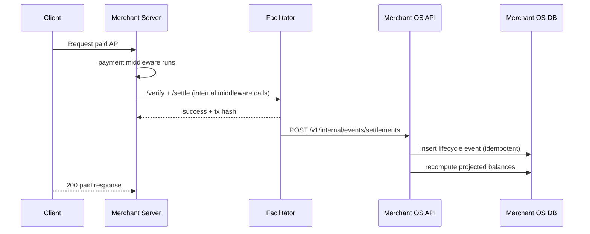
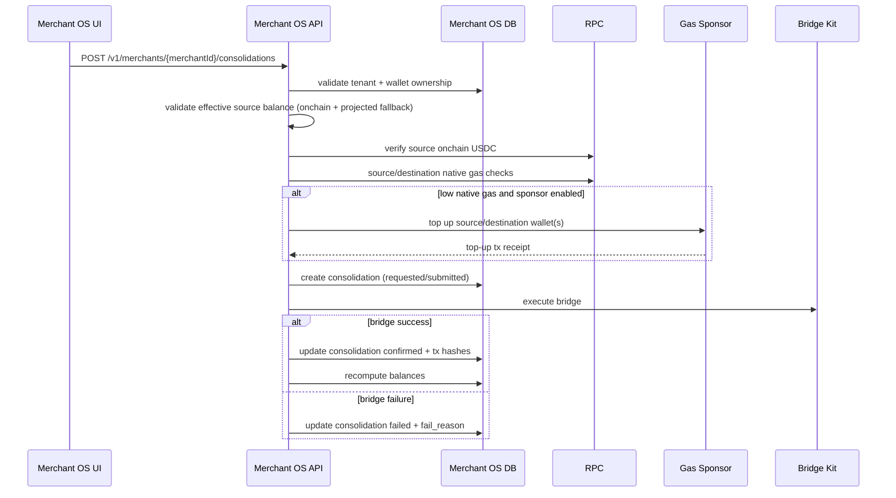

# Merchant OS Architecture (MVP)

This document describes the current end-to-end architecture for the Merchant OS prototype.

## 1) System Overview

```mermaid
flowchart LR
    Client["x402 Client"]
    MerchantServer["Merchant Server<br/>(merchant-server-merchant-os-demo.ts)"]
    Facilitator["Facilitator<br/>(verify/settle + optional bridge worker)"]
    MerchantOSAPI["Merchant OS API<br/>(Node server)"]
    Frontend["Merchant OS Frontend<br/>(Next.js + React + Tailwind)"]
    DB["SQLite DB<br/>(merchant-os/data/merchant-os.db)"]
    RPC["Public RPCs<br/>(USDC + native reads)"]
    BridgeKit["Circle Bridge Kit<br/>(consolidation execution)"]
    GasSponsor["Gas Sponsor Wallet<br/>(optional auto top-up)"]
    RevenueRegistry["RevenueRegistry Contract<br/>(Arbitrum Sepolia, optional)"]

    Client -->|GET paid API| MerchantServer
    MerchantServer -->|payment middleware (verify/settle under the hood)| Facilitator
    Facilitator -->|settlement lifecycle ingest| MerchantOSAPI
    Facilitator -->|optional recordSettlement| RevenueRegistry

    Frontend -->|/v1/* via Next rewrites| MerchantOSAPI
    MerchantOSAPI --> DB
    MerchantOSAPI -->|onchain reads| RPC

    Frontend -->|manual consolidation request| MerchantOSAPI
    MerchantOSAPI -->|bridge source->destination| BridgeKit
    MerchantOSAPI -->|optional native gas top-up| GasSponsor
```

## 2) Component Breakdown

1. `merchant-os/frontend/*`
- Login + onboarding + console UI.
- Pages: Onboarding, Overview, Settlements, Products, Payouts, Settings.
- Uses session endpoints for onboarding/settings and API-key endpoints for merchant runtime actions.

2. `merchant-os/src/server.js`
- Main API entrypoint.
- Auth/session checks, tenant isolation, ingest/internal tokens.
- Exposes onboarding APIs, merchant runtime APIs, and platform-internal settlement/requirements endpoints.

3. `merchant-os/src/db.js` + `merchant-os/src/schema.sql`
- Data model for merchants, users, accounts, wallets, custody keys, sessions, policy, API products, settlement events, balances, consolidations, payouts.
- Balance projection and timeline/API revenue aggregation logic.

4. `merchant-os/src/onchain.js`
- Reads USDC and native balances from chain RPC endpoints.
- Reads gas price for dynamic gas estimation.

5. `merchant-os/src/consolidationBridgeService.js`
- Executes real consolidation bridges using Circle Bridge Kit.
- Handles retries and failure detail extraction.

6. `merchant-os/src/gasSponsorService.js`
- Optional sponsor wallet that tops up native gas for source/destination custody wallets before bridging.

7. Facilitator integration
- `facilitator/src/services/merchantOsPublisher.ts` publishes settlement lifecycle events to Merchant OS.
- `facilitator/src/services/merchantOsPaymentGuard.ts` encapsulates requirement resolution + x402 middleware wiring for demo merchant integrations.
- `facilitator/src/merchant-server-merchant-os-demo.ts` now mounts the guard as a thin merchant-facing integration entrypoint.
- Merchant integrations should not manually call facilitator endpoints. Verify/settle happens inside payment middleware or RailBridge-hosted payment execution.

8. Optional onchain revenue proof
- `facilitator/src/services/revenueRegistryRecorder.ts` writes settlement proof to `RevenueRegistry` on Arbitrum Sepolia.

## 3) Payment + Settlement Flow



## 4) Consolidation Flow (Merchant OS Native)



## 5) Data Ownership

1. Source of payment execution truth: Facilitator settlement response + tx hash.
2. Source of Merchant OS history: `treasury_settlement_events` + consolidations + payouts.
3. Source of displayed balances:
- Primary: onchain USDC read per merchant custody wallet.
- Fallback: projected balance from event aggregation.
4. Source of custody signing authority:
- Encrypted private keys in `custody_keys`.
- Decryption via `MERCHANT_OS_CUSTODY_MASTER_KEY`.

## 6) Security and Isolation Model

1. Tenant isolation:
- Every account-scoped route enforces `merchantId + accountId` from auth session.

2. Internal endpoint protection:
- Settlement ingest requires `MERCHANT_OS_INGEST_TOKEN`.
- Requirement resolver requires `MERCHANT_OS_INTERNAL_TOKEN`.
- Ingest endpoint also accepts `x-merchant-os-internal-token` for compatibility.
- These internal endpoints are platform-to-platform contracts and are not intended as direct merchant external integration endpoints.

3. Merchant-facing resolver protection:
- `POST /v1/sdk/requirements/resolve` requires `x-railbridge-api-key`.
- Tenant is inferred from API key server-side, so merchant code does not pass internal tokens or tenant IDs.

4. Custody key handling:
- Private keys are encrypted at rest (AES-256-GCM).
- Master key is externalized via environment variable.

## 7) Runtime Modes

1. Demo mode (default UX):
- Same-chain and cross-chain settlement events can be ingested from facilitator.
- Consolidation can run in real bridge mode (`realConsolidationBridgeEnabled=true`, or env override `MERCHANT_OS_REAL_CONSOLIDATION_BRIDGE=true`).
- Payouts can run in simulation mode (`realPayoutsEnabled=false`, or env override `MERCHANT_OS_REAL_PAYOUTS_ENABLED=false`) for no-funds demos.

2. Real execution mode:
- Consolidation and payouts require valid signer key(s), supported networks, source USDC, and native gas.
- Optional auto top-up with sponsor wallet when enabled.
