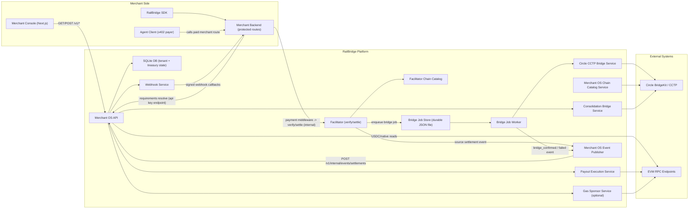
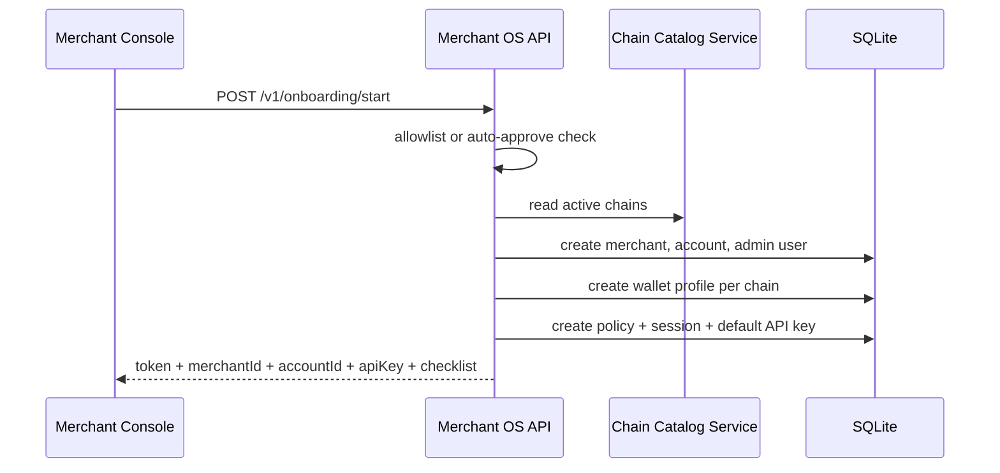
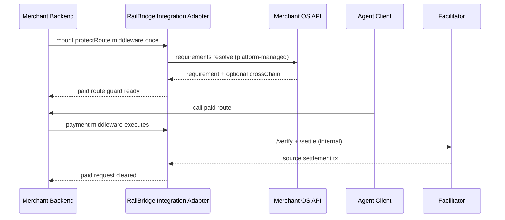
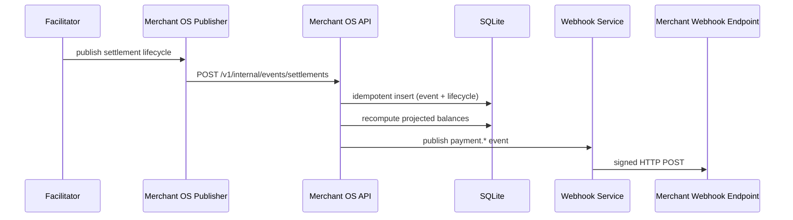
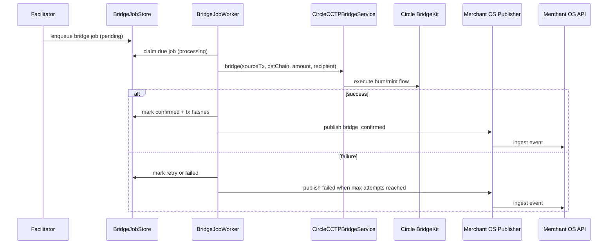
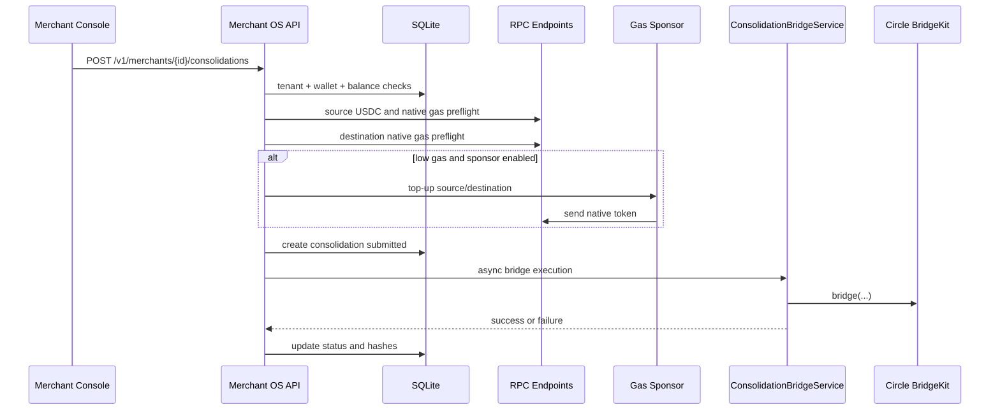
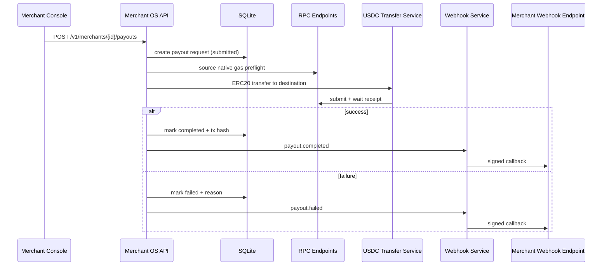

# RailBridge Merchant OS Architecture Deep Dive

Last reviewed: 2026-05-17

This document explains the current architecture in detail, based on the code that is currently implemented in this repository.

## 1) Design Goal

RailBridge Merchant OS is built to make stablecoin acceptance feel like a normal SaaS integration:

1. Merchant integrates one API/SDK.
2. Merchant does not manage wallets/chains directly.
3. Merchant gets clear lifecycle states and cash visibility.
4. RailBridge handles x402 + chain + bridge complexity under the hood.

## 2) High-Level System Diagram

## 3) Component Inventory

| Component | Responsibility | Main Files |
|---|---|---|
| Merchant Console | Onboarding and operations UI: onboarding, overview, settlements, products, payouts, settings | `merchant-os/frontend/app/*`, `merchant-os/frontend/components/console/PlatformShell.js` |
| Merchant OS API | Tenant auth, API key auth, onboarding, product config, settlement ingest, balance projection, consolidations, payouts, webhook dispatch | `merchant-os/src/server.js` |
| Merchant OS DB layer | Persistence, migrations, tenant data, lifecycle timeline, balances projection, key/webhook/product APIs | `merchant-os/src/db.js`, `merchant-os/src/schema.sql` |
| Chain catalog (Merchant OS) | Sync Circle-supported chains and load runtime RPC/USDC maps | `merchant-os/src/chainCatalogService.js` |
| Onchain read service | Fetch USDC/native balances and gas price with RPC fallback/timeout | `merchant-os/src/onchain.js` |
| Consolidation bridge | Execute manual source->destination USDC bridge via Circle BridgeKit | `merchant-os/src/consolidationBridgeService.js` |
| Payout execution | Execute USDC transfer payouts from custody wallet to destination address | `merchant-os/src/usdcTransferService.js`, `merchant-os/src/server.js` |
| Gas sponsor | Optional native-gas top-up for bridge/payout preflight | `merchant-os/src/gasSponsorService.js` |
| Webhook service | Sign and deliver merchant webhooks, persist delivery logs | `merchant-os/src/webhookService.js` |
| Facilitator | x402 verify/settle plane and cross-chain orchestration hooks | `facilitator/src/facilitator-implementation.ts` |
| Chain catalog (Facilitator) | Sync BridgeKit chains + maintain per-chain status controls | `facilitator/src/services/facilitatorChainCatalog.ts` |
| Bridge durability layer | Persist bridge jobs + retry processing across restarts | `facilitator/src/services/bridgeJobStore.ts`, `facilitator/src/services/bridgeJobWorker.ts` |
| Facilitator bridge execution | Run Circle CCTP bridge for queued jobs | `facilitator/src/services/circleCCTPBridgeService.ts` |
| Event publisher | Push settlement lifecycle events into Merchant OS ingest endpoint | `facilitator/src/services/merchantOsPublisher.ts` |
| Merchant integration SDK | `protectRoute`, `resolveRequirements`, `verifyWebhook`, `getOnboardingStatus` | `merchant-os/sdk/index.js` |

## 4) Runtime Boundaries and Trust Zones

### Merchant-facing APIs

1. Session auth endpoints (Bearer session token) for onboarding/settings workflows.
2. Merchant runtime endpoints (x-railbridge-api-key) for balances, settlements, products, consolidations, payouts.
3. Merchant SDK requirements resolver (x-railbridge-api-key):
   - `POST /v1/sdk/requirements/resolve`

### Internal platform APIs

1. Settlement ingest endpoint requires ingest/internal token:
   - `POST /v1/internal/events/settlements`
2. Internal requirements resolver requires internal token:
   - `POST /v1/internal/requirements/resolve`
3. These endpoints are platform/internal contracts in this prototype and are not intended as direct merchant external API surface.

### Facilitator admin APIs

1. Chain status override and bridge job inspection use facilitator admin bearer token.

## 5) Core Data Model

Primary logical groups:

1. Tenant identity and access
   - `merchants`, `merchant_accounts`, `merchant_users`, `auth_sessions`
2. Wallet and custody abstraction
   - `merchant_account_wallets`, `custody_keys`
3. Product and monetization config
   - `api_products`, `treasury_policy`, `api_keys`
4. Settlement and cash lifecycle
   - `treasury_settlement_events`, `treasury_balances`, `treasury_consolidations`, `treasury_payout_requests`
5. Operations controls and delivery logs
   - `chain_catalog`, `webhook_endpoints`, `webhook_deliveries`

Balance model:

1. Lifecycle events are the accounting ledger input.
2. `recomputeBalances(...)` builds projected balances.
3. Overview endpoint merges projected balances with onchain reads.

## 6) Onboarding and Provisioning Flow

Provisioned default assets:

1. One account and admin user.
2. One custody wallet profile per active chain.
3. One default API key.
4. One session token for immediate console login.

## 7) Merchant Integration Flow

Implementation reference:

1. Abstraction layer that hides resolver + x402 wiring:
   - `facilitator/src/services/merchantOsPaymentGuard.ts`
2. Thin demo merchant server that consumes the abstraction:
   - `facilitator/src/merchant-server-merchant-os-demo.ts`

Important clarification: merchants are not expected to manually call facilitator `/verify` or `/settle`. In this prototype those calls are made by the payment middleware layer used by the merchant server.

## 8) Payment Lifecycle and Event Ingest

Lifecycle statuses currently used:

1. `settled_source`
2. `bridge_pending`
3. `bridge_confirmed`
4. `failed`

Mapped merchant webhook event types:

1. `payment.settled_source`
2. `payment.bridge_pending`
3. `payment.bridge_confirmed`
4. `payment.failed`

## 9) Cross-Chain Bridge Durability Flow

Durability details:

1. Bridge jobs are persisted in JSON file storage in facilitator data dir.
2. Worker polls due jobs and retries with backoff.
3. State survives process restart because queue is file-backed.

## 10) Consolidation Flow (Merchant OS Triggered)

Important current behavior:

1. Consolidation execution is async in-process in Merchant OS server.
2. It is not yet moved to a durable DB-backed job worker.

## 11) Payout Flow

## 12) Chain Catalog and Auto-Support Model

Both Merchant OS and Facilitator run periodic sync from Circle BridgeKit:

1. Pull supported EVM chains.
2. Extract chain ID, USDC address, RPC endpoints, explorer URL.
3. Persist and refresh runtime maps.
4. Apply chain operational status: `active`, `degraded`, `paused`.

Operational control:

1. Chain status can be changed via admin endpoints without code deploy.
2. Manual override maps exist for emergency metadata correction.

## 13) Authentication and Authorization Model

Credential types:

1. Session token
   - For onboarding/settings management.
2. Merchant API key
   - For tenant runtime operations.
3. Internal token
   - For requirement resolution endpoint.
4. Ingest token
   - For facilitator settlement event ingest.
5. Admin token
   - For chain-status control endpoints.

Authorization patterns:

1. Tenant scope checks enforce `merchantId + accountId` alignment.
2. API key role model: `admin`, `finance`, `readonly`.
3. API key revoke safeguards:
   - cannot revoke last active key
   - cannot revoke last active admin key

## 14) Wallet Abstraction and Custody Notes

Current model:

1. Wallet profiles store signer references (often `mpc:*` style references).
2. Custody keys are encrypted at rest using AES-256-GCM.
3. Master key is provided by env variable.

Prototype reality:

1. This is not yet a full external MPC signing backend.
2. The abstraction boundary exists and can be replaced behind signer references.

## 15) Webhook Model

Webhook signature contract:

1. Header `x-railbridge-timestamp`
2. Header `x-railbridge-signature`
3. Signature = HMAC-SHA256(secret, `timestamp + "." + body`)

Delivery behavior:

1. Outbound `fetch` per active endpoint.
2. Delivery result persisted in `webhook_deliveries`.
3. Test event endpoint available: `POST /v1/onboarding/webhooks/test`.

## 16) Failure and Recovery Behavior

1. Settlement ingest is idempotent by event/lifecycle checks.
2. Bridge worker retries failed bridge jobs and eventually marks terminal failure.
3. Consolidation and payout failures are reflected in timeline with reasons.
4. Overview gracefully falls back to projected balances when RPC reads fail or timeout.

## 17) What Is Production-Like vs Prototype

Production-like today:

1. Tenant onboarding, auth, API keys, webhook management.
2. Requirements resolution and integration wiring.
3. Settlement lifecycle ingest and timeline visibility.
4. Chain catalog sync and chain-level ops controls.

Prototype constraints still present:

1. Consolidation execution is not durable-worker based yet.
2. Custody abstraction is present, but full external MPC signing is not integrated.
3. Payout execution is synchronous request-path execution, not async job workers.

## 18) File Map for Fast Navigation

Merchant OS backend:

1. `merchant-os/src/server.js`
2. `merchant-os/src/db.js`
3. `merchant-os/src/schema.sql`
4. `merchant-os/src/chainCatalogService.js`
5. `merchant-os/src/onchain.js`
6. `merchant-os/src/consolidationBridgeService.js`
7. `merchant-os/src/usdcTransferService.js`
8. `merchant-os/src/webhookService.js`

Facilitator:

1. `facilitator/src/facilitator-implementation.ts`
2. `facilitator/src/services/merchantOsPublisher.ts`
3. `facilitator/src/services/bridgeJobStore.ts`
4. `facilitator/src/services/bridgeJobWorker.ts`
5. `facilitator/src/services/circleCCTPBridgeService.ts`
6. `facilitator/src/services/facilitatorChainCatalog.ts`

Frontend:

1. `merchant-os/frontend/app/page.js`
2. `merchant-os/frontend/app/onboarding/page.js`
3. `merchant-os/frontend/app/overview/page.js`
4. `merchant-os/frontend/app/settlements/page.js`
5. `merchant-os/frontend/app/products/page.js`
6. `merchant-os/frontend/app/payouts/page.js`
7. `merchant-os/frontend/app/settings/page.js`

SDK:

1. `merchant-os/sdk/index.js`
