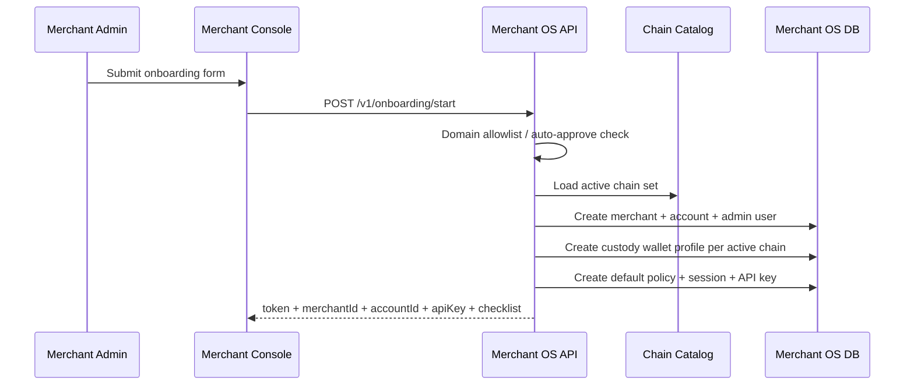
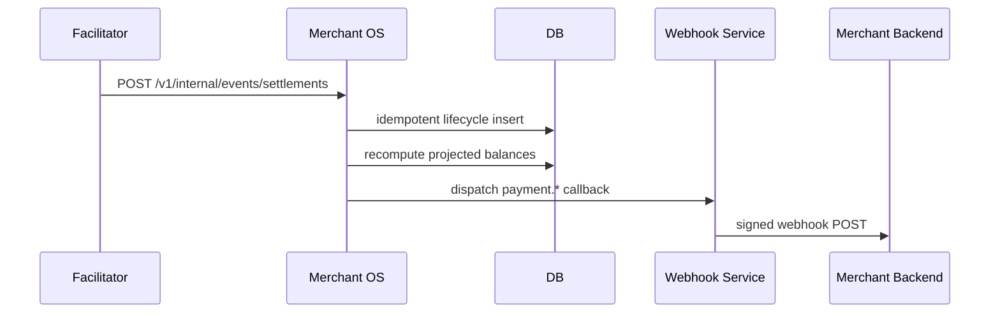

# RailBridge Merchant Onboarding And Integration (Technical)

Last reviewed: 2026-05-19

This guide explains how onboarding and merchant integration work in the current prototype.

## 1) The Core Contract

RailBridge is designed so merchants can accept USDC without learning chain internals.

Merchant teams do:

1. Create account and team access.
2. Create API key(s).
3. Register webhook URL.
4. Create paid product/route definitions.
5. Integrate requirement resolution + payment middleware.

RailBridge platform does:

1. Wallet abstraction and custody plumbing.
2. Verify/settle execution through the payment plane.
3. Multi-chain lifecycle handling.
4. Settlement event ingestion, balance projection, dashboard updates.
5. Signed webhook delivery.

Important: merchants do not manually call facilitator `/verify` and `/settle`.

## 2) Onboarding Sequence (Recommended)

Use this order:

1. Create account.
2. Create API key and copy it once.
3. Register webhook endpoint.
4. Create first paid product.
5. Run first sandbox payment.
6. Run payout test.

The console checklist tracks these states as `Current`, `Upcoming`, and `Completed`.

## 3) End-To-End Provisioning Flow



## 4) What Gets Created At Signup

`POST /v1/onboarding/start` creates:

1. Merchant row.
2. Merchant account row.
3. Admin user row.
4. Custody wallet profile per active supported chain.
5. Default treasury policy.
6. Session token.
7. Default API key.

This is why a merchant can log in and immediately configure products and webhooks.

### 4.1 Custody address assignment model

Current behavior for custodial MPC wallets:

1. Each merchant account gets a tenant-derived signer identity.
2. For the same merchant account, the EVM address is consistent across EVM chains (same signer, same address string).
3. Different merchants get different custody addresses.

Operational note:

1. RailBridge still keeps an internal ledger/timeline for lifecycle state (`settled_source`, `bridge_pending`, `bridge_confirmed`, `failed`) and reconciliation, even with merchant-isolated custody addresses.

## 5) Authentication Model

Two main credentials are used by merchant teams:

1. Session token (`Authorization: Bearer ...`) for onboarding/settings management APIs.
2. API key (`x-railbridge-api-key`) for runtime merchant APIs (balances, products, settlements, payouts).

Platform-only credentials:

1. Internal token for requirements resolver prototype endpoint.
2. Ingest token for settlement lifecycle ingest.

## 6) Merchant Setup APIs (With Examples)

### 6.1 Start onboarding

```bash
curl -X POST http://localhost:4030/v1/onboarding/start \
  -H "content-type: application/json" \
  -d '{
    "merchantName":"Acme Robotics",
    "adminEmail":"ops@acme.com",
    "adminPassword":"StrongPass123!",
    "complianceProfile":{"country":"US"}
  }'
```

### 6.2 Create webhook endpoint

```bash
curl -X POST http://localhost:4030/v1/onboarding/webhooks \
  -H "authorization: Bearer <SESSION_TOKEN>" \
  -H "content-type: application/json" \
  -d '{"url":"https://api.acme.com/webhooks/railbridge"}'
```

### 6.3 Create paid product

```bash
curl -X POST http://localhost:4030/v1/merchants/<MERCHANT_ID>/products \
  -H "x-railbridge-api-key: <API_KEY>" \
  -H "content-type: application/json" \
  -d '{
    "apiId":"premium_search_v1",
    "apiName":"Premium Search",
    "method":"POST",
    "path":"/api/premium-search",
    "amountUsdc":"0.05"
  }'
```

Defaults if advanced fields are omitted:

1. `sourceNetwork = any`
2. `settlementMode = cross_chain`
3. `destinationNetwork` resolved by policy/fallback

### 6.4 Manage existing API keys and webhooks

Supported lifecycle actions:

1. API keys:
   - Create: `POST /v1/onboarding/api-keys`
   - Edit: `PATCH /v1/onboarding/api-keys/{apiKeyId}`
   - Revoke: `POST /v1/onboarding/api-keys/{apiKeyId}/revoke`
2. Webhooks:
   - Create: `POST /v1/onboarding/webhooks`
   - Edit: `PATCH /v1/onboarding/webhooks/{webhookId}`
   - Delete: `DELETE /v1/onboarding/webhooks/{webhookId}`

## 7) Merchant Backend Integration Flow

### Current prototype wiring (simplified)

SDK helpers currently available:

1. `protectRoute(...)`
2. `resolveRequirements(...)`
3. `verifyWebhook(...)`
4. `getOnboardingStatus(...)`

For local prototype/demo, use the platform-managed adapter:

1. `facilitator/src/services/merchantOsPaymentGuard.ts`
2. `facilitator/src/merchant-server-merchant-os-demo.ts`

Merchant-facing integration shape:

```js
const paymentGuard = await createMerchantOsPaymentGuard({
  facilitatorUrl,
  merchantOsApiUrl,
  merchantApiKey: process.env.RB_API_KEY,
  route: { method: "GET", path: "/api/premium" }
});

app.use(paymentGuard.middleware);
app.get("/api/premium", handler);
```

Prototype note:

1. The adapter resolves requirements via merchant API key.
2. Merchant code does not need internal tokens or tenant IDs.
3. Verify/settle stays abstracted in middleware.

### Payment execution responsibility

Once payer calls a paid route:

1. Payment middleware executes verify/settle internally.
2. Facilitator handles x402 verification/settlement mechanics.
3. Merchant route handler receives the paid request as normal business logic.

Merchants do not hand-code facilitator HTTP calls.

## 8) Webhooks: What They Are And Why They Matter

A webhook is RailBridge sending event payloads to the merchant backend URL.

If webhook is not configured:

1. Core payment flow can still run.
2. Merchant becomes blind to async lifecycle updates unless they poll APIs.
3. Ops visibility and automation quality drops.

So webhook is operationally optional but strongly recommended.

### Expected webhook URL

Use a backend endpoint that accepts public HTTPS POST callbacks.

Examples:

1. `https://api.yourcompany.com/webhooks/railbridge`
2. `https://app.yourcompany.com/api/webhooks/railbridge`

Do not use:

1. Frontend page URLs.
2. Private localhost URL without tunnel.
3. Merchant OS API URL.

### Signature verification model

1. Header: `x-railbridge-timestamp`
2. Header: `x-railbridge-signature`
3. Signature: `HMAC_SHA256(secret, timestamp + "." + rawBody)`

Express example:

```js
import express from "express";
import { verifyWebhook } from "@railbridge/sdk";

const app = express();
app.use("/webhooks/railbridge", express.text({ type: "application/json" }));

app.post("/webhooks/railbridge", (req, res) => {
  const ok = verifyWebhook({
    secret: process.env.RB_WEBHOOK_SECRET,
    timestamp: req.header("x-railbridge-timestamp"),
    payload: req.body,
    signature: req.header("x-railbridge-signature")
  });

  if (!ok) {
    return res.status(401).json({ error: "invalid signature" });
  }

  const event = JSON.parse(req.body);
  // handle event.type
  return res.status(200).json({ ok: true });
});
```

Primary event types:

1. `payment.settled_source`
2. `payment.bridge_pending`
3. `payment.bridge_confirmed`
4. `payment.failed`
5. `payout.completed`
6. `payout.failed`
7. `webhook.test`

## 9) Product Model Clarifications

### What is `apiId`?

`apiId` is a merchant-defined product identifier for your own catalog and reporting.

Rules:

1. Must be unique per merchant account.
2. Does not need to be globally unique across all merchants.

### Edit/delete product support

Runtime APIs support full lifecycle:

1. Create
2. Edit (`PUT /v1/merchants/{merchantId}/products/{apiProductId}`)
3. Delete (`DELETE /v1/merchants/{merchantId}/products/{apiProductId}`)

## 10) Internal Settlement Ingestion Flow



This is platform-to-platform plumbing. Merchants do not call this endpoint.

## 11) Terms That Often Cause Confusion

### Domain gating

Signup can be limited to allowlisted domains unless auto-approve is enabled.

Config:

1. Runtime config: `onboardingAllowlistDomains`
2. Runtime config: `onboardingAutoApprove=true`
3. Optional env overrides: `MERCHANT_OS_ONBOARDING_ALLOWLIST_DOMAINS`, `MERCHANT_OS_ONBOARDING_AUTO_APPROVE=true`

### MPC in wallet abstraction

MPC (Multi-Party Computation) means private-key control is abstracted behind signer references so merchants do not manage raw keys.

Current prototype keeps this abstraction boundary, while full external MPC backends remain a production hardening step.

## 12) Troubleshooting Quick List

1. `403 domain_not_allowlisted`:
   Set allowlist domains or enable auto-approve.
2. Missing webhook deliveries:
   Verify URL reachability, signature secret, and test event result.
3. `insufficient source balance` during consolidation:
   Check source balance on Overview and selected source network.
4. `Invalid API key`:
   Use active key via `x-railbridge-api-key` and confirm not revoked.

## 13) Recommended Next Hardening

1. Expose requirements resolution as merchant-public API contract.
2. Publish/version `@railbridge/sdk` package.
3. Add webhook retry policy + dead-letter strategy.
4. Move payout execution to durable worker model.
